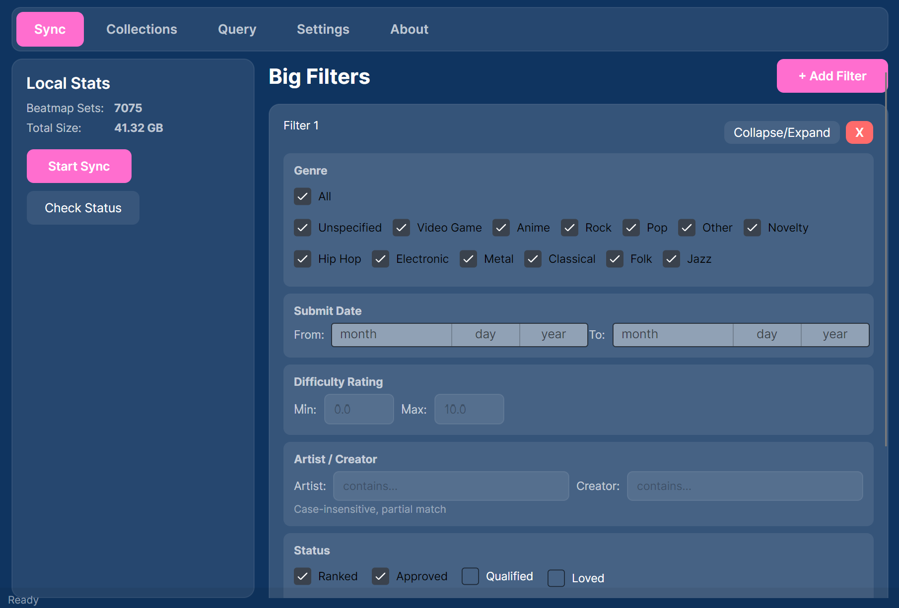

# OsuMapManager

An osu! lazer beatmap management tool — sync your local library against a beatmap database, query beatmaps, and manage your collections.



## Usage

1. **Settings** — Point the app to your osu! lazer installation folder and a beatmap database (contains only metadata for downloading reference; you can download one from `./map_dbs`, or generate one using `fetch_catboy.py`).
2. **Sync** — Define "big filters" (genre, date range, difficulty, status, modes, etc.) and sync beatmaps into your local library. Multiple big filters can be added — the final sync target is a union of all filters.
3. **Collections** — Import, export, and trim beatmap collections on your osu! lazer client.
   - **Import** — Select a `.txt` collection file exported from this app, check which beatmaps are available locally, download missing ones, then apply them to your osu! collections.
   - **Export** — Export your osu! collections to a `.txt` file with optional difficulty rating filtering.
   - **Trim** — Remove difficulties outside a star range from selected collections.
4. **Query** — Search your local library or the beatmap database for specific maps.

## Requirements

- **Windows** (x64 / arm64) — prebuilt release available
- **Linux** (x64 / arm64) — build from source or use the prebuilt release
- **macOS** (x64 / arm64) — build from source or use the prebuilt release

All releases are **self-contained** — no .NET runtime installation required. Just download and run.

## Build from Source

Requires [.NET 10 SDK](https://dotnet.microsoft.com/download/dotnet/10.0).

Use the provided build script for multi-platform release builds:

```bash
# Build all 6 targets (win/linux/osx × x64/arm64)
python build_release.py

# Build specific targets only
python build_release.py --only win-x64,linux-x64

# Preview without building
python build_release.py --dry-run
```

Or manually publish for a single target:

```bash
# Windows x64
dotnet publish OsuMapManager/OsuMapManager.csproj -c Release -r win-x64

# Linux x64
dotnet publish OsuMapManager/OsuMapManager.csproj -c Release -r linux-x64

# macOS ARM64
dotnet publish OsuMapManager/OsuMapManager.csproj -c Release -r osx-arm64
```

Output binaries are placed in `./releases/`.

## Tech Stack

Avalonia UI · Realm · CommunityToolkit.Mvvm · catboy.best mirror
